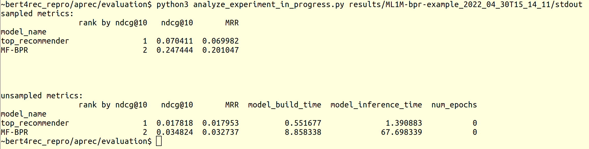

# BERT4Rec-Replicability

This repository contains the code and the documentation necessary to replicate our results reported in the BERT4Rec replicability and reproducibility study. 

## Installation 
The instruction has been tested on an Ubuntu 22.04 LTS machine with an NVIDIA RTX 3090 GPU. 

Please follow this step-by-step instruction to reproduce our results


### 1. Install Anaconda environment manager: 

If you don't have anaconda installed in your system, please follow the instruction https://docs.anaconda.com/anaconda/install/linux/

### 2. Create the project working directory
```
mkdir aprec_repro
cd aprec_repro
```


### 3. Create an anaconda environment with necessary package versions:
```
conda create -y --name aprec_repro python=3.9.12 cudnn=8.2.1.32 cudatoolkit=11.6.0  pytorch-gpu=1.10.0 tensorflow-gpu=2.6.2 gh=2.1.0 expect=5.45.4
```

### 4. Add working working directory to the PYTHONPATH of the anaconda environment: 
```
conda env config vars set -n aprec_repro PYTHONPATH=`pwd`
```

### 5. Activate the environment
```
conda activate aprec_repro
```

### 6. Install python packages in the environment: 
```
pip3  install "jupyter>=1.0.0" "tqdm>=4.62.3" "requests>=2.26.0" "pandas>=1.3.3" "lightfm>=1.16" "scipy>=1.6.0" "tornado>=6.1" "numpy>=1.19.5" "scikit-learn>=1.0" "lightgbm>=3.3.0" "mmh3>=3.0.0" "matplotlib>=3.4.3" "seaborn>=0.11.2" "jupyterlab>=3.2.2" "telegram_send>=0.25" "transformers>=4.16.1" "recbole>=1.0.1" "wget>=3.2" "pytest>=7.1.2" "pytest-forked>=1.4.0"
```

### 7. Clone necessary github repos into workdir: 
**Note: during the paper review stage, please use code in the tar archives linked as addtional materials instead of cloning github repos.**


#### 7.1 our patched version of BERT4Rec-VAE-Pytorch version. 
The patch allows the code to be used as a library: We have to keep this repo separately due to licenses incompatibility


```
git clone <anonymous> b4rvae
```

#### 7.2 This github repo: 

```
git clone <anonymous> aprec
```

### 8. Test the code
Your environment is now ready to run the experiments. To ensure that everything works correctly, run the tests:

```
cd aprec/tests
pytest --verbose --forked . 
```

# Runnig experiments

### 1.  Go to aprec evaluation folder: 
```
cd <yor working directory>
cd aprec/evaluation
```

### 2. Run example experiment: 
you need to run `run_n_experiments.sh` with the experiment configuration file. Here is how to do it with an example configuration: 


```
sh run_n_experiments.sh configs/ML1M-bpr-example.py
```

**Note**

For experiment reproducibility purposes run_n_experiments.sh requires that all code in the repository is commited before running the experiment. The framework records commit id in the experiment results, so that it is always possible to return to exatly the same state of the repository and rerun the experiment. 
If you want to override this behaviour, set environment variable `CHECK_COMMIT_STATUS=false`. For example: 

```
CHECK_COMMIT_STATUS=false sh run_n_experiments.sh configs/mf_config.py
```

### 3. Analyze experiment results
Experiment may be running for some time. 
To watch what's going on with the experiment in realtime, just tail the the experiment stdout (the link to stdout is given as an output of `run_n_experiments.sh`)

```
tail -f run_n_experiments.sh ./results/<experiment_id>/stdout
````

You may also check results of the models that already have been evaluated using ```analyze_experiment_in_progress.py``` script: 

```
python3 analyze_experiment_in_progress.py ./results/<experiment_id>/stdout
```
This will give pretty formatted representation of the results: 




